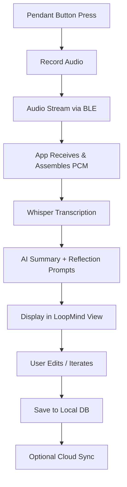

# Whispair LoopMind – Product Requirements Document (MVP)

**Version:** 1.0  
**Date:** 25 Oct 2025  
**Author:** Tom + Product Engineering Team  
**Product Type:** Wearable-linked Mobile App (Flutter)  
**Platforms:** Android / iOS  
**Hardware:** Whispair Pendant (Seeed XIAO nRF52840 Sense)

---

## 1. Product Overview

**Whispair LoopMind** is a voice-first idea companion that fuses the Whispair wearable recorder with an AI-driven mobile app.  
Users capture spontaneous thoughts through the pendant, and the app transcribes, summarises, and helps them refine ideas into actionable insights through AI feedback loops.

The MVP will deliver the **end-to-end loop**:
1. Capture audio via the pendant (BLE stream)  
2. Transcribe to text  
3. Generate AI summary and reflection prompts  
4. Let users review, edit, and store their evolving ideas  
5. Operate fully offline with optional encrypted sync

---

## 2. MVP Objectives

| Goal | Description | Success Metric |
|------|--------------|----------------|
| Rapid capture | Seamless BLE audio transfer from pendant | <3 s connection, reliable audio streaming |
| AI transcription | Local or cloud Whisper STT | ≥ 90 % transcription accuracy (clear speech) |
| AI iteration | Generate 1-3 relevant refinement prompts | 80 % user engagement with at least one prompt |
| Idea storage | Local database of notes + tags | 100 % persisted data after app restart |
| Usability | Clean, calm UI with clear feedback | Positive UX rating (> 4 / 5 in pilot) |

---

## 3. Target Users

- **Entrepreneurs / Creators:** capture raw ideas on the move  
- **Designers / Engineers:** document problem statements verbally  
- **Knowledge workers:** transform thoughts into summaries or action lists  
- **Students / Thinkers:** record and refine study insights

---

## 4. Key Features (MVP Scope)

| Category | Feature | Description |
|-----------|----------|-------------|
| **Hardware Integration** | BLE pairing | Discover `Whispair-LoopMind` devices and maintain connection |
|  | Audio streaming | Receive PCM 16-bit mono @ 8 kHz from pendant |
|  | Haptic feedback | Vibrate pendant on record start/stop |
| **Audio Processing** | PCM to WAV wrapper | Assemble full recording and add header |
|  | Opus compression | Compress for local storage |
| **AI Layer** | Whisper transcription | Local or API speech-to-text |
|  | GPT-4-mini summarisation | Generate 1-sentence idea summary |
|  | Reflection prompts | 2–3 AI-generated expansion questions per note |
| **Data Layer** | Local DB (Isar/Hive) | Store audio path, transcript, summary, tags |
|  | File system | `/notes/<timestamp>.(opus|txt|json)` |
| **UI / UX** | 3 Tabs | *Timeline*, *LoopMind*, *Settings* |
|  | Timeline view | List of ideas with title, snippet, tags |
|  | LoopMind view | Interactive refinement interface |
|  | Playback / Edit | Play, edit, or delete notes |
|  | BLE status banner | Connection + battery indicator |
| **Security & Privacy** | AES-256 local encryption | All stored data encrypted |
|  | Consent toggles | Local-only / Cloud-enabled mode |
| **Sync (Phase 2)** | Optional Supabase/Firebase backup | User-initiated manual sync |

---

## 5. Out-of-Scope (for MVP)

- Continuous background listening  
- Real-time streaming transcription  
- Multi-user collaboration  
- Web dashboard  
- Firmware OTA updates  
- Cloud analytics

---

## 6. User Flow Summary



---

## 7. Technical Stack

| Layer | Tool / Framework |
|--------|------------------|
| Frontend | Flutter 3.x (Dart) |
| BLE | flutter_blue_plus |
| Audio | flutter_ffmpeg + opus_dart |
| AI STT | OpenAI Whisper (local / API) |
| AI NLP | GPT-4-mini / Claude Sonnet |
| Database | Isar / Hive |
| Cloud (Phase 2) | Supabase / Firebase |
| Encryption | pointycastle (AES-256) |

---

## 8. Data Model (Simplified)

```json
{
  "id": "UUID",
  "created_at": "ISO8601",
  "title": "Short summary",
  "transcript": "Full text",
  "summary": "AI summary",
  "reflections": ["prompt1", "prompt2", "prompt3"],
  "audio_file": "path/to/file.opus",
  "tags": ["innovation", "design"],
  "device_id": "Whispair_001"
}
```

---

## 9. Milestones & Timeline

| Phase | Deliverable | Duration | Owner |
|--------|--------------|-----------|--------|
| **P0 – Firmware Check** | Validate BLE stream from pendant | 1 week | HW Eng |
| **P1 – Core BLE + Audio** | Audio capture → WAV | 2 weeks | Flutter Dev |
| **P2 – Transcription Layer** | Whisper integration | 2 weeks | AI Eng |
| **P3 – AI Summariser + Prompts** | GPT API + UI loop | 2 weeks | AI / UX |
| **P4 – Local Storage + UI Polish** | DB + timeline views | 2 weeks | Flutter Dev |
| **P5 – Testing & Pilot** | Internal alpha + bug fixes | 3 weeks | QA / PM |
| **Total** | MVP Release | **~12 weeks total** | — |

---

## 10. Success Metrics (MVP Validation)

- 95 % BLE connection reliability across 20 sessions  
- < 2 s latency from “SEND” to audio receipt start  
- > 80 % transcription accuracy  
- > 60 % of users engage with at least one AI reflection per session  
- Crash-free rate > 99 %  
- Pilot satisfaction ≥ 4 / 5

---

## 11. Future Roadmap (Post-MVP)

- **Idea Graph:** semantic map of related thoughts  
- **Real-Time Transcription Preview** via BLE stream  
- **Gesture-based capture** using pendant IMU  
- **Firmware OTA updates**  
- **Team collaboration** (shared spaces)  
- **Subscription tier (FoundAir)** with advanced AI synthesis  

---

## 12. Branding & UX Principles

- **Mood:** Calm, intelligent, minimalist.  
- **Palette:** Soft whites, desaturated blues, warm neutrals.  
- **Typography:** Inter / SF Rounded.  
- **Motion:** Subtle micro-animations; pendant vibration sync on events.  
- **Voice:** Clear, reassuring, quietly confident.

---

## 13. Risks & Mitigations

| Risk | Impact | Mitigation |
|------|---------|------------|
| BLE connection instability | High | Implement retry + reconnection logic |
| Audio corruption during transfer | Medium | Add checksum / sequence validation |
| Whisper API latency | Medium | Cache locally, allow offline transcription |
| Privacy concerns | High | Encrypt by default, no background capture |
| Battery life of pendant | Medium | Optimize sleep cycle, add low-power mode |

---

## 14. Deliverables (MVP Completion)

- Flutter app (.apk / TestFlight build)  
- Whispair BLE integration validated  
- Whisper + GPT APIs configured  
- Local DB + encryption functioning  
- Core UI: Timeline, LoopMind, Settings  
- Pilot test results + user feedback report  

---

## 15. Acceptance Criteria

- User can record via pendant → see new note in timeline  
- AI generates summary + at least two prompts  
- Note stored locally with playback and edit  
- BLE reconnects automatically after sleep  
- App operates offline in local-only mode  

---

### **End of Document**
